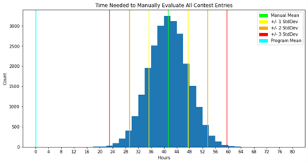

# D195: BS Data Management & Data Analytics Capstone

## Course Summary

WGU states that D195 Data Management/Analytics Undergraduate Capstone challenges students to demonstrate competencies supporting all BSDMDA program outcomes. Students will identify an organizational need, plan and develop a data analytics product to serve that need, and document the process in a project proposal and data project report. 

This course has three Practical Assessments. 

## Course Objectives

WGU outlines the following competencies as a part of this class:
- **Professional Readiness:** The graduate integrates and synthesizes competencies from across the degree program, thereby demonstrating the ability to participate in and contribute value to the chosen professional field.

## Course Materials

This class does not have any course materials.

## Practical Assessment(s) Overview & Files

This course has three Practical Assessments. 

### Task 1

This task requires students to develop a proposal for the topic of their capstone project, beginning with defining the intended research question as well as the null and alternative hypotheses for the study. Students must explain the context of the intended research and justify the processes, techniques, and tools to be used in the course of gathering, preparing, and analyzing the data. The capstone project is required to be "business-oriented" as a means to demonstrate preparation for entering the professional realm from the academic. A number of topics are also listed as being "retired" by WGU because they have been previously covered, meaning that these topics may not be selected for capstone research. 

For context, before beginning the BSDMDA in Feb 2022, I had taken on a freelance data analysis project in Oct 2021 for senior NHL writer [Sean "Down Goes Brown" McIndoe](https://twitter.com/DownGoesBrown) of [The Athletic](https://theathletic.com/author/sean-mcindoe/). McIndoe runs an annual contest in which entrants make a series of specific predictions for the forthcoming NHL season, which are posted in the comments of his article at The Athletic announcing that year's contest and the questions for which predictions are submitted. In the first year of the contest, 2020-21, this got over 800 entries, which had to be handled manually by McIndoe. [The 2021-22 contest would end up receiving nearly 1600 entries](https://theathletic.com/2869497/2021/10/10/down-goes-brown-predict-the-nhl-season-with-the-return-of-the-contest-thats-so-easy-its-almost-impossible/), and I contracted to handle the contest, scraping the contest entries using BeautifulSoup from TheAthletic's comment section, building a custom parser to handle the inconsistent formatting of each entry and load the 46 answers per entrant into a dataframe, and then standardizing every single entry. This was then loaded into a Google Sheet for McIndoe to peruse, and I generated a number of observations for him of the contest data which were used by McIndoe in follow-up pieces. At the end of the season, I would then grade the contest entries and provide a new set of observations about the contest outcomes. [More detail about this project can be found in my repository dedicated the project here.](https://github.com/WJTownsend/2021-22_DGB_contest)

For my capstone project, I submitted the idea of elaborating on this project I had taken on for McIndoe. In order to generate a research question and a hypothesis to test, I posited a comparison between the manual task of recording, standardizing, and grading contest entries against my programmatic solution. The null hypothesis would state that the programmatic approach was not statistically significantly faster than the manual approach, while the alternative hypothesis stated that the programmatic approach would be found to be statistically significantly faster than manual handling. This would require a sample of the contest entries to be manually handled as a point of comparison to the programmatic handling, and T-testing would be used to test if the programmatic processing time was statistically significant from the manual processing time. 

[The full proposal for my capstone project can be found here.](d195task1.pdf)

This task did not require a video. 

### Task 2

This task requires the student to generate a report that outlines the context of the problem at issue and the justification for a data analysis solution, including goals, benefits, and deliverables of the data analysis project. Students must outline the project's scope, methodology, timeline, and criteria for success, while also explaining the design of their solution (methods, tools, etc.) and how this plan is justified by the data involved. Students must also address concerns about both data governance and data quality. 

Essentially, this project is an *extremely* detailed and involved extension of the Task 1 proposal. My report on this largely consisted of formalizing things that I had already done, or adding some explanations for how I would address the extension of this project to fit the capstone rubric. [My report for this task  can be viewed here.](d195task2.pdf) Note that code is not included in that report, but the full and very lengthy code for the program can be seen in the linked repository dedicated solely to the project. 

This task did not require a video. 

### Task 3

This task requires the student to generate a report that summarizes the execution of the data analysis plan generated in task 2. This included outlining the data collection and preparation processes, evaluation of the planned schedule, and obstacles encountered in the collection/preparation phase. Students then describe the analysis process, including advantages and disadvantages of the process and tools used, the outcomes of the analysis process itself, statistical and practical significance of study results, and the benefits of the analysis. 

To generate the manual processing for comparison to the programmatic processing, I manually recorded, standardized, and graded 16 samples of 10 unique contest entries, just over 10% of the entries submitted to the contest. Each of these samples were timed, and then the time taken was multiplied by 158 to extrapolate the time taken on a sample to the full population of contest entries. This created 16 different times for the manual handling of contest entries, with a mean time to handle all 1580 entries of 41 hours 20 minutes and a standard deviation of 6 hours 6 minutes. 

Once this was done, I then ran the script to perform the same tasks, timing how long this took and repeating the process 5 times. This process had a mean time to handle all 1580 entries of 5 minutes 45 seconds, with a standard deviation of around 4 seconds. The t-test indicated that this was a statistically significant difference, allowing me to reject the null hypothesis in favor of the conclusion that the programmatic approach to handling contest entries was better than the manual one. 

This task also required a video presentation intended for a lay audience, covering most aspects of the report as well as demonstrating the successful operation of all code included in the analysis. [That video can be seen here](https://drive.google.com/file/d/1KpU15NSBgPr_TeSPebIqlRv7hRxPRw2f/view?usp=share_link).