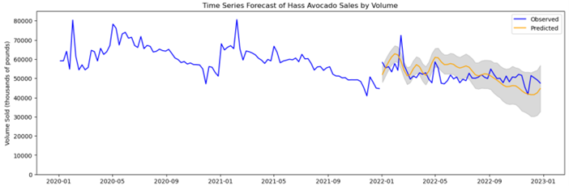
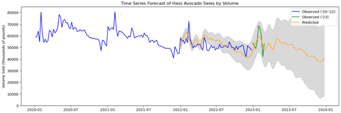

# D214: MS Data Analytics Capstone

## Course Summary

WGU states that D214 The Data Analytics Graduate Capstone allows students to apply the academic and professional abilities developed as a graduate student. This capstone challenges students to integrate skills and knowledge from several program domains into one project.

This course has three Practical Assessments. 

## Course Objectives

WGU outlines the following competencies as a part of this class:
- **Professional Readiness:** The graduate integrates and synthesizes competencies from across the degree program, thereby demonstrating the ability to participate in and contribute value to the chosen professional field.

## Course Materials

This class does not have any course materials. 

## Practical Assessment(s) Overview & Files

This course has three Practical Assessments. 

### Task 1

This task requires students to develop a proposal for the topic of their capstone project, beginning with defining the intended research question as well as the null and alternative hypotheses for the study. Students must explain the context of the intended research and justify the processes, techniques, and tools to be used in the course of gathering, preparing, and analyzing the data. The capstone project is required to be "business-oriented" as a means to demonstrate preparation for entering the professional realm from the academic. A number of topics are also listed as being "retired" by WGU because they have been previously covered, meaning that these topics may not be selected for capstone research. 

For my capstone project, I proposed using [data published by the Hass Avocado Board](https://hassavocadoboard.com/) regarding weekly purchases of Hass avocados in 2020 - 2022 in the United States to generate a forecasting model for Hass avocado sales. The null hypothesis would state that it would not be possible to generate an effective forecasting model from this data, while the alternative hypothesis posted that it would. The distinction for what constituted an "effective" forecasting model would be one with a mean absolute percentage error of < 20%. This project would make use of a number of standard Python libraries such as pandas, NumPy, MatPlotLib, and SciKit-Learn, as well as [an open source forecasting library called Prophet (formerly FBProphet)](https://facebook.github.io/prophet/), published by Facebook's core data science team. 

[The full proposal for my capstone project can be found here.](d214task1.pdf)

This task did not require a video. 

### Task 2

This task requires the student to perform their capstone research topic and create a report outlining the various steps of this process. This includes the research question, the data collection & preparation processes, the analysis addressing the research question, and a summary of the outcome of the analysis, including limitations, recommendations, and additional opportunities for supplemental research. 

My research question for this project was *"Can sales of conventional Hass avocados in the United States be effectively forecasted based solely on the research data?"* After defining the null and alternative hypotheses using the evaluation metrics described in task 1, I collected and prepared the Hass Avocado Board's data for analysis, including filling in missing data. Exploratory data analysis was performed, examining a number of perspectives within the data relating to the sales of conventional vs organic avocados, regional pricing, and trends in the data. Time series forecasting was then performed, using 2020 & 2021 as a training set and 2022 as a test set, beginning with ARIMA and SARIMA models and then proceeding to a model generated by Prophet. 

As demonstrated here, the generated model ended up being quite successful. The model had a mean absolute percentage error of 9.2%. 

Forecasts for 2023 using the preliminary data available from the Hass Avocado Board for the first two months of 2023 had a similar error. This easily surpassed the threshold of < 20% necessary to reject the mean hypothesis in favor of the alternative. I had expected to be able to generate a forecasting model of adequate effectiveness, but this was actually a much great success than I had anticipated. [My full report for this project, including all of my Python code, can be viewed here.](d214task2.ipynb)

This task did not require a video. 

### Task 3

This task requires the student to develop an executive summary of their capstone project from Task 2. This executive summary is intended for an audience with expertise in data analysis, and it must communicate the study problem & hypothesis, the data analysis process, study findings, study limitations, recommended actions (including avenues for further study), and expected corporate benefits. [The executive summary for my capstone project can be viewed here.](d214task3.pdf)

The student must also generate a multimedia presentation of their capstone project covering many of the same elements. This presentation is intended for a lay audience without prior knowledge or expertise in data analysis or the subject at issue. [That video can be seen here](https://drive.google.com/file/d/1mXes0hSLamDup7qHxHqF9Ep_aVQAqx9j/view?usp=share_link).